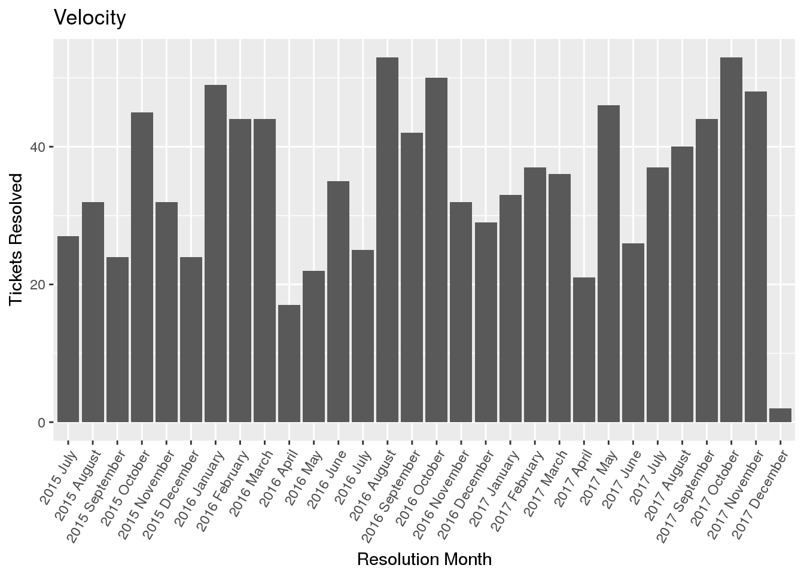
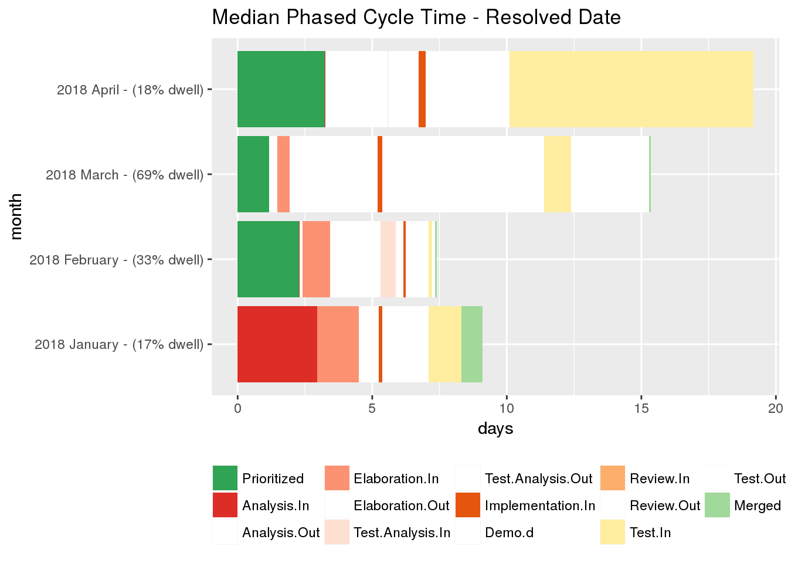
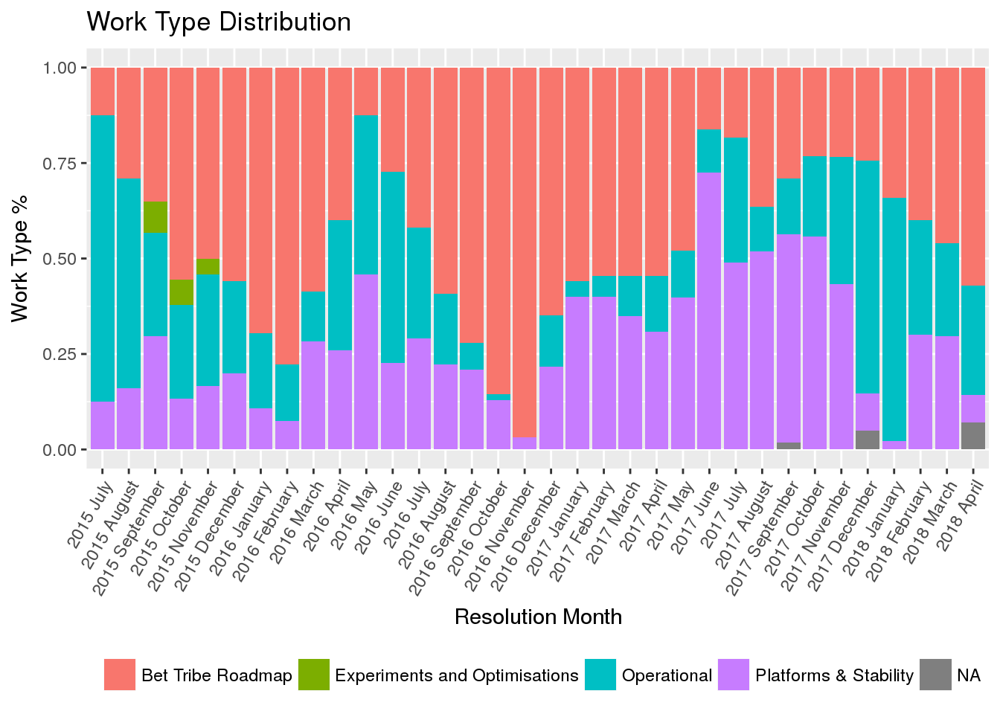
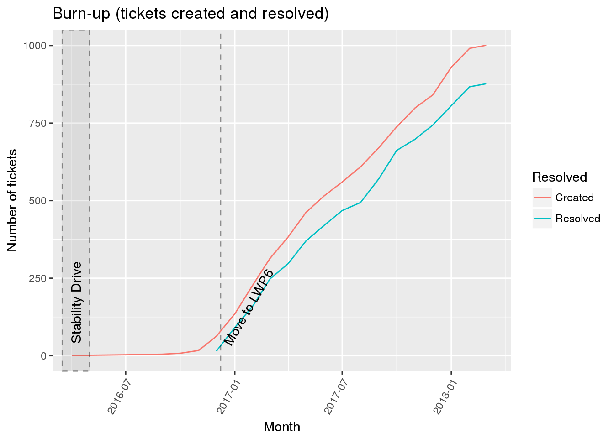

# Summary

This project creates some pictures based on jira data and uploads the resulting html report to confluence.
These should allow squads to gain some insight into their development cycle. Hopefully provoking discussions on improving the flow of work.

# Usage

1. get Jira Access Token
2. Run script against project

e.g.
```
echo -n Username:Password | base64
sh ./RUNME.sh <JIRAACCESSTOKEN> <PROJECT> <PUBLISH?>
sh ./RUNME.sh <randombase64hash> TS PUBLISH
```

# Examples

Tickets completed per month


Phased cycle time


Work Type ratio


Annotated Burnup


# Installation


## Setup config

The first time RUNME.sh is run, it copies three example config files.
These need updating with your details.

The first: `atlassianDetails.sh` needs the url of the rest-endpoint for Jira and Confluence

The second: `extract/boardList.js` is a mapping from jira project keys to boardIds. Instuctions are in the example file

The third: `extract/customFields.js` is to define fields to extract beyond the named jira fields. Three fields are defined from our boards and described in the Examples section below. If you have similar fields, change the link in this file.

You may manually create these config files before the first run by removing the .example suffix from the filenames and populating them yourself.

## Build docker containers

Docker containered versions allow other teams to run their own stats at their own cadence. They allow one person to setup the system, and provide the executable docker-contained version to other teams.
The report container takes an especially long time to build and the extact container contians some user specific configuration.
For that reason, we provide the ability to build a base 'dev' version and a tagged user version for usage by others in your team.
The 'user' version should be built after setting up the config described in the following section

* docker build -t jirar-extract:dev extract
* docker build -t jirar-extract:skybet extract -f extract/Dockerfile.skybet
* docker tag jirar-extract:skybet secretdockerrepo.com/jirar/jirar-extract:skybet
* docker push secretdockerrepo.com/jirar/jirar-extract:skybet

* docker build -t jirar-report:dev report
* docker build -t jirar-report:skybet report -f report/Dockerfile.skybet
* docker tag jirar-report:skybet secretdockerrepo.com/jirar/jirar-report:skybet
* docker push secretdockerrepo.com/jirar/jirar-report:skybet


# Known Issues / Workarounds

## 500 Error from jira greenhopper (agile board) api


    Got 500 response from jira @ "https://tools.skybet.net/jira/rest/agile/1.0/board/793/configuration"
    ERR
    { 'status-code': 500,
      'stack-trace': 'java.lang.NullPointerException\n\tat com.atlassian.greenhopper.api.rest.bean.BoardConfigBeanFactory.createRankingConfigBean(BoardConfigBeanFactory.java:102)
        at com.atlassian.greenhopper.api.rest.bean.BoardConfigBeanFactory.toBean(BoardConfigBeanFactory.java:48)
        at ...


In Jira, Board admin configure the board - and append: “ORDER BY Rank ASC” to the Filter Query.

# Todo list / Idea List

* When looking up spend+worktype from the epic, look at other project's boards too 
* Shiny http://rmarkdown.rstudio.com/authoring_shiny.html
* Extract blocked time
* Extract re-work time/counts
* Integrate with stash to apply codebase metrics
* publish docker files to dockerhub

* Tribe level reports

